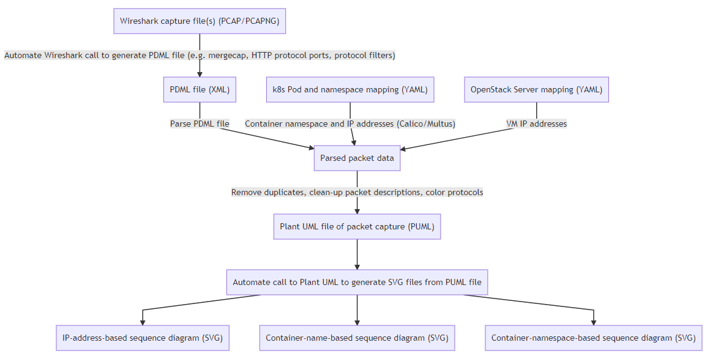
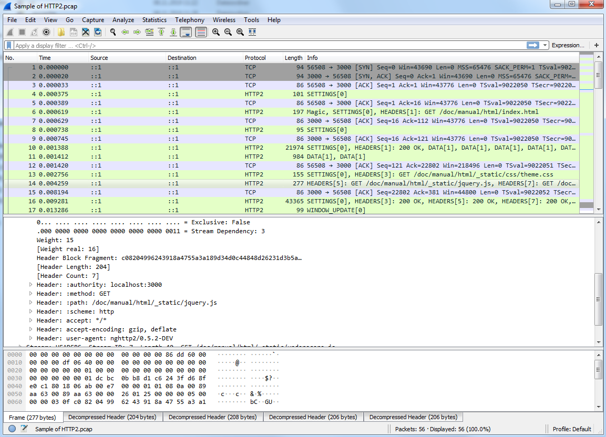

# 5G Trace Visualizer

* Table of contents
  * [Summary](#summary)
  * [Requirements](#requirements)
  * [Application structure](#application-structure)
  * [Examples](#examples)

# Summary

This set of Python scripts allow you to convert ``pcap``, ``pcapnp`` or ``pdml`` 5G protocol traces ([Wireshark](https://www.wireshark.org/), [tcpdump](https://www.tcpdump.org/), ...) into SVG sequence diagrams.

It was born from the need to automatically convert 5G traces into something readable given:
* Mix of HTTP/2, 5G-NAS and PFCP protocols
* Sequence details are quite tiring to check in the Wireshark GUI
* Specific versions of Wireshark may be needed to decode specific versions of (e.g.) 5G-NAS
* The shift to containers results into traces with multiple IP addresses that are dynamically allocated by k8s
* Mapping of IPs to container names in the deployment
* In some cases, what is of interest are the exchanges between namespaces and not between containers
* Mapping of IPs to VM names in the deployment
* We could not find a commercial tool doing exactly what we needed. While [PlantUML](http://plantuml.com/) can generate nice diagrams, doing those manually requires too much time.

## Requirements
* You need to have Java installed (executing the ``java`` command must launch Java). this is required because PlantUML runs on Java
* ``plantuml.jar`` must be placed in the base directory (see [``place plantuml.jar here.txt``](place plantuml.jar here.txt)). This application was tested with the 2019.11 version (Apache Software License Version) of ``plantuml.jar``. You can find it [here](http://sourceforge.net/projects/plantuml/files/plantuml-jar-asl-1.2019.12.zip/download).
* Wireshark portable of the desired versions placed in the ``/wireshark`` folder. See [instructions in folder](/wireshark/Readme.md).

## Application structure

The figure below summarizes what this small application does ([SVG](doc/summary.svg), [PNG](doc/summary.png), [Mermaid](doc/summary.mermaid))

## Examples

While at some point it would be nice to have real 5G traces as examples, it is currently not possible to post those. They typically contain intra-NF communication and/or protocol specifics. So they are not easy to come by.

As alternative, we will use the sample HTTP/2 capture from the [Wireshark wiki](https://wiki.wireshark.org/HTTP2) and show you how to use the application with the [``http2-h2c.pcap``](https://wiki.wireshark.org/HTTP2?action=AttachFile&do=get&target=http2-h2c.pcap) file

As shown in Wireshark, the capture should look as shown below:

